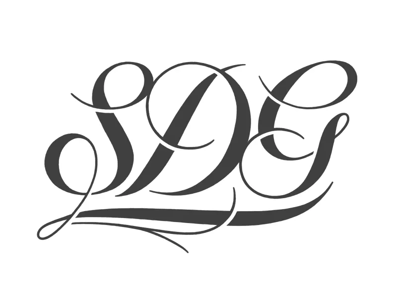

# Soli Deo Gloria — A Public Domain Dedication

> **Version 2.0.0-beta.4.** The dedication statement is under review and may still change before 2.0.0 is released. If you need text that will not move under you, adopt the 1.0.0 text from the [`main`](https://github.com/pjedlund/soli-deo-gloria-dedication/tree/main) branch and switch once 2.0.0 ships.

All glory to God.

God made everything that is. Nothing any of us makes is made from nothing: we work with what we were given, with hands and minds we did not make, in a world we did not build. What we call creating is arranging, and what we arrange was never ours. To put our name on the result and call it property is to claim what was never ours to claim.

SDG says that plainly, and then does the legal work required to make the renunciation take effect. The law has no way to record "this was never mine," so SDG uses the nearest instrument it provides: an established public domain dedication, reproduced verbatim beneath the statement. The statement is the point. The legal text is the mechanism, and it is kept below the line where a mechanism belongs.

The dedication claims no tradition. It is written to be usable by anyone who holds that the world was given and not earned, by whatever name they know the One who gave it — the conviction is far older and wider than the Latin phrase that names this project.

## Choosing a base

SDG comes in three variants. They share the same statement and differ only in which dedication does the operative work.

| File | SPDX identifier | Suited to |
| --- | --- | --- |
| [`variants/SDG-Either.txt`](variants/SDG-Either.txt) | `CC0-1.0 OR Unlicense` | Most projects. The recipient relies on whichever works for them. |
| [`variants/SDG-CC0.txt`](variants/SDG-CC0.txt) | `CC0-1.0` | Prose, art, scholarship, data, cultural-heritage material. |
| [`variants/SDG-Unlicense.txt`](variants/SDG-Unlicense.txt) | `Unlicense` | Source code. |

The split is not a matter of taste. CC0 carries a moral-rights fallback, database rights, and a construction clause built for jurisdictions that do not recognise outright waiver, which makes it the stronger instrument for content. The Unlicense is OSI-approved and carries no express patent disclaimer, which makes it the easier instrument for code. Neither grants patent rights. [docs/choosing-a-base.md](docs/choosing-a-base.md) sets out the reasoning; [docs/patents-and-code.md](docs/patents-and-code.md) and [docs/moral-rights.md](docs/moral-rights.md) cover the two places where every public domain dedication reaches its limit.

If you would rather not decide, use `SDG-Either.txt`. Declining to impose one legal regime on the person receiving the work is consistent with the rest of the dedication.

## How to apply SDG

See [HOW-TO-APPLY.md](HOW-TO-APPLY.md) for copy-paste recipes covering whole repositories, single source files, books and EPUBs, websites, and datasets. Common questions are answered in [FAQ.md](FAQ.md).

## Bach and Tolstoy

The letters at the head of the dedication are Bach's. He wrote **S.D.G.** at the end of a finished score, having opened it with **J.J.** — *Jesu Juva*, "Jesus help" — so that the work was bracketed by a prayer at the start and an ascription at the end. He was not doing anything unusual: the formula was common among churchmen of his time, and Handel, Buxtehude and Graupner all used it, while Haydn closed his scores with *Laus Deo*. That it was conventional does not make it empty. It means an entire working culture had a habit of not claiming the credit, and the habit outlived the people who kept it carelessly.

Leo Tolstoy is the reason this project exists rather than merely the reason it has a name. Bach renounced nothing; he was a salaried church employee, paid by commission, and the inscription cost him no property. Tolstoy actually did the thing. He renounced copyright on his later writings so they would belong to whoever needed them, and it cost him a decades-long fight inside his own family. The Orthodox Church declared him fallen away in 1901, on the grounds that he had rewritten the Gospels to keep the moral teaching and drop the miracles, and had taken the church's dogmatic theology apart in print.

The words are taken here in their strict sense: glory to God alone leaves none over for any institution, any office, or any author. That reading lives in the words themselves and does not depend on what Bach or anyone else meant by them — which is also Tolstoy's own method, since he did not surrender "gospel" or "the kingdom of God" to the church but argued they had been taken and took them back.

The dedication names neither man. It states its conviction and stops, so it can be adopted by anyone who holds that the world was given rather than earned, whatever tradition they hold it in. [docs/the-name.md](docs/the-name.md) carries the sources and is explicit about which claims are firm and which are not.

## Origin

SDG was first written for and adopted by the [tolstoy.life](https://tolstoy.life/) project, where the Bach and Tolstoy framing was a natural fit for an open scholarship project rooted in Tolstoy's own renunciation of copyright. SDG is now maintained as a neutral, standalone project so any third party can adopt it without inheriting tolstoy.life branding. Tolstoy is the first adopter and the origin of the statement, not the home of the project.

## Reusing SDG in your own project

Anyone may adopt SDG by copying one of the files in `variants/` into the root of their own project as `LICENSE`. The name "SDG" and the statement may be reused as-is. If you modify the statement in ways that change its meaning, you must not call your modified version "SDG" or any close variant — see [docs/trademark.md](docs/trademark.md). The CC0 1.0 and Unlicense texts must remain verbatim; do not edit them. To propose changes to the statement, docs, or examples, see [CONTRIBUTING.md](CONTRIBUTING.md).

## License of this project itself

The files of the SDG project — this README, the documentation in `docs/`, the examples in `examples/`, the [FAQ](FAQ.md), the [contributing guide](CONTRIBUTING.md), and the [changelog](CHANGELOG.md) — are themselves dedicated under SDG, using the `SDG-Either` variant. `SPDX-License-Identifier: CC0-1.0 OR Unlicense`.
